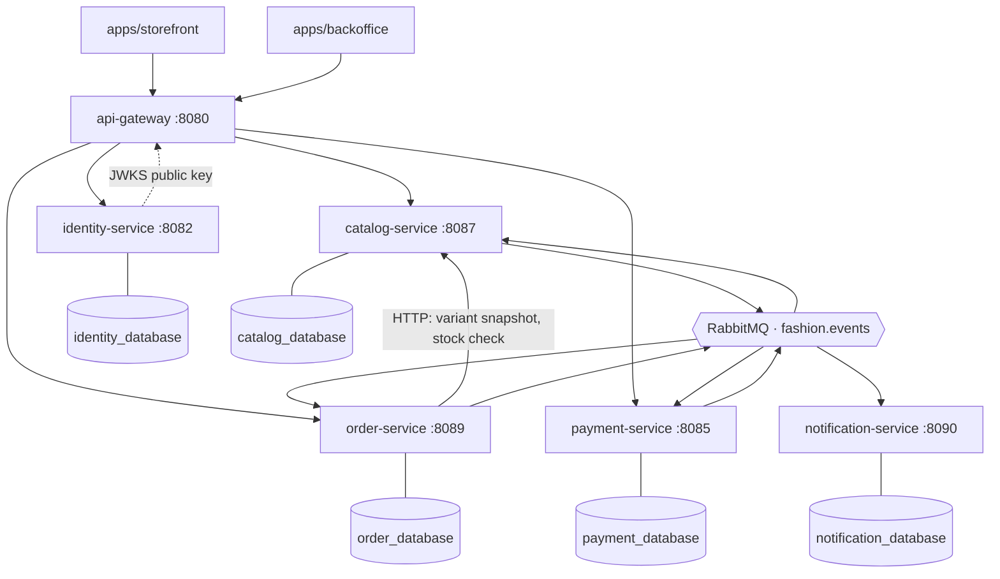
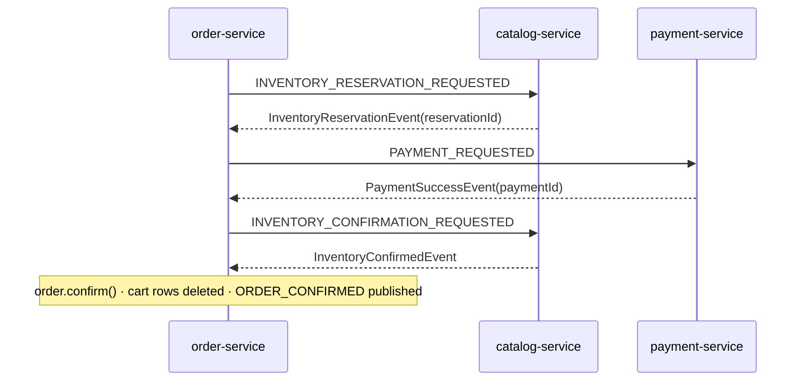

# Fashion Store Microservices Roadmap

The active backlog is tracked in [refactor-plan.md](refactor-plan.md). This file
describes architecture, service ownership, and required patterns. Statements here
were verified against the code on 2026-09-06.

## Services

Five business services behind one gateway — 13 containers, 9 Maven modules
(5 services + gateway + `packages/{api-contracts,common-library,test-utils}`).

| module | port | database | owns |
|---|---|---|---|
| `platform/gateway` (`api-gateway`) | 8080 | — | routing, JWT verification, the only public entry point |
| `identity-service` | 8082 | `identity_database` | users, credentials, roles, RS256 signing, JWKS |
| `payment-service` | 8085 | `payment_database` | payment records, PayPal/VNPAY/COD, provider callbacks |
| `catalog-service` | 8087 | `catalog_database` | products, variants, categories, brands, size charts, inventory, reservations, media library |
| `order-service` | 8089 | `order_database` | cart, checkout, orders, order saga |
| `notification-service` | 8090 | `notification_database` | asynchronous email delivery |

Merged away, do not re-create: `product-service`, `inventory-service` and
`file-service` are now `catalog-service`; `cart-service` is now `order-service`.

## Architecture



Between services, `order-service → catalog-service` is the only synchronous
business call. Everything else crosses a boundary as a RabbitMQ message on the
`fashion.events` direct exchange, with the routing key equal to the `EventTypes`
constant. The remaining HTTP traffic is infrastructural: the gateway routing
inbound requests, and every verifier fetching identity's JWKS.

## Order saga

`order_saga` is a separate row from `orders`, and it owns the in-flight state.
The `orders.status` column only ever holds a settled value — `PENDING` while the
saga runs, then `CONFIRMED` or `CANCELLED`. There is no `PENDING_INVENTORY` or
`CONFIRMING_INVENTORY` status; ask `order_saga.step` for that.



| step | timeout | on failure |
|---|---|---|
| `RESERVE_INVENTORY` | 60s | out of stock → close saga, cancel order. Nothing held yet, so no compensation |
| `AUTHORIZE_PAYMENT` | 900s | payment failed → `RELEASE_INVENTORY`; timeout → `CANCEL_PAYMENT` first |
| `CONFIRM_INVENTORY` | 60s | order stays `PENDING` until inventory acknowledges |
| `DONE` | — | terminal |

- Compensation steps are `CANCEL_PAYMENT` and `RELEASE_INVENTORY`; saga status moves `RUNNING → COMPENSATING → COMPENSATED`.
- A completed payment rejects cancellation, so the order proceeds instead of releasing paid stock.
- A reservation reply that lands after the saga closed is released once as an orphan reservation — it does not reopen the state machine.
- `OrderSagaTimeoutScanner` re-publishes the same command payload built by `SagaCommands`, so a retry is byte-identical to the first attempt.
- Consumers dedupe on `messageId` + a versioned consumer name (`SagaConsumers`), backed by `processed_message`.

## Why the decomposition shrank from 8 services to 5

The original split was drawn along **noun boundaries** — one service per entity
family (product, inventory, file, cart, order). That is the split a domain model
suggests, and it is the wrong criterion. A service boundary has to be drawn where
the *cost of crossing it* is low: independent deploy cadence, independent failure
model, independent scaling need. Three of the original eight boundaries failed
that test.

**`inventory` ← `product`: the boundary cut through an aggregate.** `Inventory`
is keyed by `variantId`, which belongs to the `ProductVariant` aggregate. Every
saga step — reserve, confirm, release — therefore had to make an HTTP round trip
to read data that logically sits in the row next to it, and neither side could
hold a transaction across the pair. The boundary bought nothing and charged a
network hop plus an eventual-consistency window on every order.

**`file` ← `product`: no independent reason to exist.** The media library existed
only to serve product images. It shared the same release cadence, the same
consumers and the same access rules. A separate service meant a second Postgres,
a second security config and a second deployment for one entity and one upload
endpoint.

**`cart` ← `order`: checkout needed both sides atomically.** Checkout reads the
cart and writes the order. Split apart, that read was an HTTP call and clearing
the cart after confirmation had to be a fire-and-forget message with an explicit
"if this fails we do not roll back the order" comment. Merged, it is one
transaction — and the trade-off is now visible and deliberate rather than hidden:
a failed cart delete rolls the order confirmation back with it.

**What was kept separate, and why that is the same argument.** `payment-service`
integrates an external provider, so its change cadence and its failure modes are
genuinely unlike the rest of the system. `identity-service` is a security
boundary that issues the tokens everything else verifies. `notification-service`
is 168 lines, but it is a pure consumer — the one place where the asynchronous
event flow is visible end to end. Each of these pays for its boundary.

**Conclusion.** Knowing when *not* to split is as much an architectural result as
knowing when to. Merging took 3 Feign clients down to 2, 12 Maven modules down to
9 and 17 containers down to 13, while every pattern the design set out to
demonstrate — gateway, database-per-service, synchronous calls, asynchronous
events, saga, outbox, idempotent consumers — is still present and still exercised.
Operating cost fell; what the architecture demonstrates did not shrink with it.

## Required patterns

- Database-per-service: one Postgres container and one Flyway history per service. No cross-service query, no cross-service FK.
- Domain events for cross-service side effects; payloads owned by `packages/api-contracts` (`com.fashionstore.contracts.*`, artifactId `event-contracts`).
- Outbox pattern for reliable publishing: `OutboxEventRecorder` writes to `outbox_event` in the business transaction, `OutboxEventRelay` drains it on a schedule and retries with backoff.
- Idempotent consumers via `processed_message` (`@EnableProcessedMessages` + `ProcessedMessageService`), keyed on `messageId` + consumer name.
- Saga with explicit compensation for order placement; the saga row owns its own deadlines.
- Idempotency keys for checkout, order placement, payment initiation and payment callbacks.
- Anti-corruption clients for synchronous calls: `ProductClient` and `InventoryClient` (Feign impls `ProductFeignClient` / `InventoryFeignClient`), both pointed at `app.clients.catalog-base-url`.
- Pessimistic order/payment locks so provider callbacks and compensation serialize.
- Snapshots, not relations: cart and order items copy the variant snapshot instead of holding a JPA relation into another service's table.

## Local infrastructure

```bash
docker compose config          # validate first
docker compose up -d rabbitmq  # or: docker compose up -d
```

RabbitMQ management UI at `http://localhost:15672` (`guest` / `guest`).

## Known gaps

- **No consumer for the inventory saga commands.** `RESERVE_INVENTORY`, `CONFIRM_INVENTORY` and `RELEASE_INVENTORY` are bound to queues in `catalog-service`, but `InventoryReservationService` does not exist — commands sit in the queue and the saga times out. This is P5b in [refactor-plan.md](refactor-plan.md).
- **The `inventory` table does not match the `Inventory` entity.** `V20` creates `available_quantity` and no `product_id` / `status`; the entity expects `quantity`, `product_id NOT NULL`, `status NOT NULL`. `ddl-auto: none` hides this at startup — it fails at query time. Fix belongs with P5b.
- **`ProductVariantStockEvent` has no producer.** The listener carried over from `inventory-service` is dead code, and `upsertStock` cannot insert a new row anyway because the event carries no `productId`.
- **`notification-service` still owns a Postgres database.** The plan's target was to drop it for Redis; that has not been done.
- `packages/test-utils` is in the reactor but no service depends on it.

## Next service boundaries

Planned only — no code, not in the reactor. The placeholder directories under
`services/` were removed; the intent is recorded here.

1. `customer-service`: customer profiles, addresses, preferences, lifecycle data. Credentials stay with `identity-service`.
2. `search-service`: read-optimized product search. Must consume product events, never query `catalog_database`.
3. `recommendation-service`: may use Python, but its API and events must be versioned in `packages/api-contracts`.

Read the consolidation rationale above before adding any of these. The
decomposition was just cut from 8 to 5 on the grounds that a boundary must pay
for itself; a new one has to make that case first.
